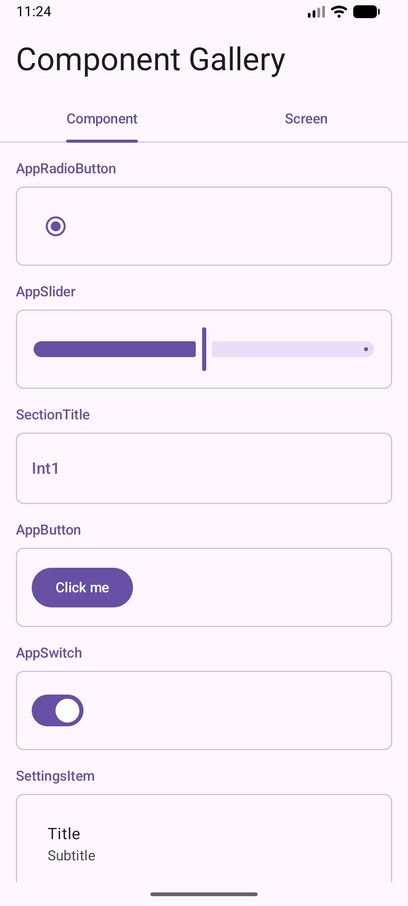
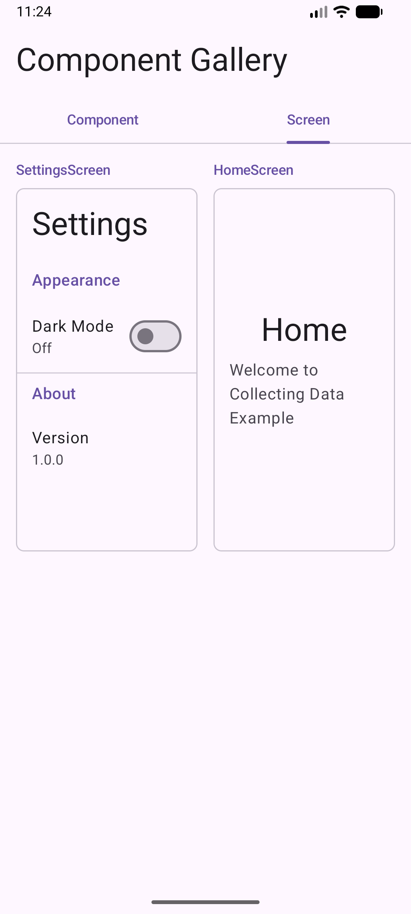

# Collecting Data Example

**分散配置されたコンポーネント情報を DI で自動収集し、ギャラリー画面に一覧表示するサンプル**

各モジュールに配置された Composable コンポーネントが、Metro DI の `@ContributesTo(AppScope::class)` を使って自動的に `Set<DesignSystemComponentData>` に集約されます。
コンポーネントを追加するだけで、手動でリストを管理することなくギャラリーに反映される仕組みです。

## スクリーンショット

| Component タブ | Screen タブ |
|:-:|:-:|
|  |  |

## モジュール構成

```
samples/collecting-data/
├── androidApp/          # Android エントリポイント (AppGraph 生成)
├── ui-components/       # 共通 UI コンポーネント + DI Module
│   └── gallery/         # ギャラリー画面
├── feature/
│   ├── home/            # Home 画面 + DI Module
│   └── settings/        # Settings 画面 + DI Module
└── sharedUI/            # 共有 Compose UI
```

## 仕組み

### 1. コンポーネント情報のデータモデル

各コンポーネントは名前・種別・プレビュー用 Composable を持つ [`DesignSystemComponentData`](ui-components/src/commonMain/kotlin/com/example/collecting/data/uicomponents/DesignSystemComponentData.kt) で表現されます。

```kotlin
data class DesignSystemComponentData(
    val name: String,
    val type: Type,
    val content: @Composable () -> Unit,
) {
    enum class Type { Component, Screen }
}
```

### 2. コンポーネントの自動登録

各コンポーネントファイル内に Metro DI の Module を定義し、`@ContributesTo(AppScope::class)` で `DesignSystemComponentData` を提供します。
例: [`AppButton.kt`](ui-components/src/commonMain/kotlin/com/example/collecting/data/uicomponents/AppButton.kt)

```kotlin
@Composable
fun AppButton(
    text: String,
    onClick: () -> Unit,
    modifier: Modifier = Modifier,
) {
    Button(onClick = onClick, modifier = modifier) {
        Text(text = text)
    }
}

@ContributesTo(AppScope::class)
@BindingContainer
object AppButtonModule {
    @Provides
    @IntoSet
    fun provide(): DesignSystemComponentData = DesignSystemComponentData(
        name = "AppButton",
        type = DesignSystemComponentData.Type.Component,
        content = { AppButton(text = "Click me", onClick = {}) },
    )
}
```

Screen も同様のパターンで登録します。
例: [`HomeScreen.kt`](feature/home/src/commonMain/kotlin/com/example/collecting/data/feature/home/HomeScreen.kt)

```kotlin
@ContributesTo(AppScope::class)
@BindingContainer
object HomeModule {
    @Provides
    @IntoSet
    fun provideHomeScreen(): DesignSystemComponentData = DesignSystemComponentData(
        name = "HomeScreen",
        type = DesignSystemComponentData.Type.Screen,
        content = { HomeScreen() },
    )
}
```

### 3. DI グラフによる収集

[`AppActivity.kt`](androidApp/src/main/kotlin/com/example/collecting/data/androidApp/AppActivity.kt) で `@DependencyGraph` を定義すると、Metro が全モジュールの `DesignSystemComponentData` を自動収集します。`bindingContainers` にクラスを列挙する必要はありません。

```kotlin
@DependencyGraph(scope = AppScope::class)
internal interface AppGraph {
    val components: Set<DesignSystemComponentData>
}

class AppActivity : ComponentActivity() {
    private val appGraph: AppGraph by lazy { createGraph() }

    override fun onCreate(savedInstanceState: Bundle?) {
        super.onCreate(savedInstanceState)
        setContent {
            MaterialTheme {
                Surface {
                    GalleryScreen(components = appGraph.components)
                }
            }
        }
    }
}
```

### 4. ギャラリー画面での表示

[`GalleryScreen.kt`](ui-components/gallery/src/commonMain/kotlin/com/example/collecting/data/uicomponents/gallery/GalleryScreen.kt) が `Set<DesignSystemComponentData>` を受け取り、Component / Screen をタブで切り替えて表示します。Screen タブはグリッド表示、Component タブはリスト表示に対応しています。

## ポイント

- **中央レジストリ不要**: 各コンポーネントが自分自身を登録するため、一箇所にリストを管理する必要がない
- **モジュール境界を跨いだ収集**: `feature:home` や `feature:settings` など別モジュールの Screen も同じ仕組みで収集される
- **スケーラブル**: 新しいコンポーネントを追加する際は、ファイル内に Module を定義するだけ

## ビルド・実行

### Android

```bash
./gradlew :androidApp:assembleDebug
```

### Desktop

```bash
./gradlew :desktopApp:run
```

### Web (JS)

```bash
./gradlew :webApp:jsBrowserDevelopmentRun
```

### Web (Wasm)

```bash
./gradlew :webApp:wasmJsBrowserDevelopmentRun
```

### iOS

Xcode で `iosApp/iosApp.xcproject` を開いて実行してください。
